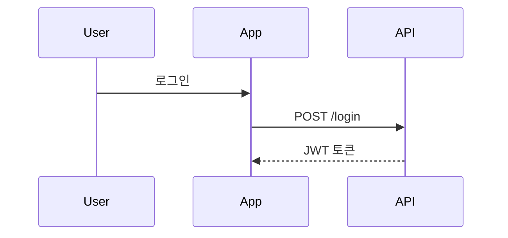

# Claude Desktop MCP 설정 가이드

## 1. Claude Desktop 앱 설치

1. [Claude Desktop](https://claude.ai/download) 다운로드
2. macOS: .dmg 파일 실행 후 Applications로 드래그
3. 앱 실행 및 로그인

## 2. MCP 설정 파일 위치

### macOS
```bash
~/Library/Application Support/Claude/claude_desktop_config.json
```

### Windows
```
%APPDATA%\Claude\claude_desktop_config.json
```

### Linux
```
~/.config/claude/claude_desktop_config.json
```

## 3. BAI AutoTest MCP 설정

### 설정 파일 생성/편집

1. 터미널에서 설정 파일 열기:
```bash
# macOS
open ~/Library/Application\ Support/Claude/
# 또는 에디터로 직접 편집
nano ~/Library/Application\ Support/Claude/claude_desktop_config.json
```

2. 다음 내용 추가:

```json
{
  "mcpServers": {
    "bai-autotest": {
      "command": "/Users/bettehub/.pyenv/versions/3.11.9/bin/python",
      "args": [
        "-m",
        "bai_test_mcp.mcp.server"
      ],
      "cwd": "/Users/bettehub/Dev/devai/bai-autotest",
      "env": {
        "PYTHONPATH": "/Users/bettehub/Dev/devai/bai-autotest/src"
      }
    }
  }
}
```

### 여러 MCP 서버가 있는 경우

```json
{
  "mcpServers": {
    "bai-autotest": {
      "command": "/Users/bettehub/.pyenv/versions/3.11.9/bin/python",
      "args": ["-m", "bai_test_mcp.mcp.server"],
      "cwd": "/Users/bettehub/Dev/devai/bai-autotest",
      "env": {
        "PYTHONPATH": "/Users/bettehub/Dev/devai/bai-autotest/src"
      }
    },
    "filesystem": {
      "command": "npx",
      "args": ["-y", "@modelcontextprotocol/server-filesystem", "/Users/bettehub/Documents"]
    }
  }
}
```

## 4. Claude Desktop 재시작

1. Claude Desktop 앱 완전 종료
   - macOS: Cmd+Q 또는 메뉴바에서 Quit
   - Windows: Alt+F4 또는 시스템 트레이에서 종료
2. 앱 다시 실행

## 5. MCP 도구 확인

1. Claude Desktop에서 새 대화 시작
2. 슬래시(/) 입력 또는 📎 버튼 클릭
3. "bai-autotest" 도구들이 보이는지 확인:
   - parse_diagram
   - generate_test
   - list_scenarios
   - analyze_diagram

## 6. 사용 방법

### 기본 사용법
```
/tools

사용 가능한 도구를 확인할 수 있습니다.
```

### 다이어그램 파싱
```
parse_diagram 도구를 사용해서 이 다이어그램을 파싱해주세요:


```

### 테스트 생성
```
generate_test 도구로 "User Login" 시나리오의 Playwright 테스트를 생성해주세요.
설정: framework="playwright", config={"base_url": "http://localhost:3000"}
```

## 7. 문제 해결

### MCP가 로드되지 않는 경우

1. **설정 파일 문법 확인**
   ```bash
   # JSON 유효성 검사
   python -m json.tool ~/Library/Application\ Support/Claude/claude_desktop_config.json
   ```

2. **Python 경로 확인**
   ```bash
   which python
   # pyenv 사용 시
   pyenv which python
   ```

3. **패키지 설치 확인**
   ```bash
   cd /Users/bettehub/Dev/devai/bai-autotest
   pip install -e .
   ```

4. **MCP 서버 직접 테스트**
   ```bash
   cd /Users/bettehub/Dev/devai/bai-autotest
   /Users/bettehub/.pyenv/versions/3.11.9/bin/python -m bai_test_mcp.mcp.server
   ```

### 로그 확인

macOS:
```bash
# Claude 로그 확인
~/Library/Logs/Claude/
```

### 권한 문제

파일 접근 권한 확인:
```bash
ls -la ~/Library/Application\ Support/Claude/
chmod 644 ~/Library/Application\ Support/Claude/claude_desktop_config.json
```

## 8. 고급 설정

### 환경별 설정

개발/운영 환경 분리:
```json
{
  "mcpServers": {
    "bai-autotest-dev": {
      "command": "/Users/bettehub/.pyenv/versions/3.11.9/bin/python",
      "args": ["-m", "bai_test_mcp.mcp.server"],
      "cwd": "/Users/bettehub/Dev/devai/bai-autotest",
      "env": {
        "PYTHONPATH": "/Users/bettehub/Dev/devai/bai-autotest/src",
        "ENV": "development"
      }
    },
    "bai-autotest-prod": {
      "command": "bai-autotest",
      "args": ["serve"],
      "env": {
        "ENV": "production"
      }
    }
  }
}
```

### 디버그 모드

```json
{
  "mcpServers": {
    "bai-autotest": {
      "command": "/Users/bettehub/.pyenv/versions/3.11.9/bin/python",
      "args": ["-m", "bai_test_mcp.mcp.server", "--debug"],
      "cwd": "/Users/bettehub/Dev/devai/bai-autotest",
      "env": {
        "PYTHONPATH": "/Users/bettehub/Dev/devai/bai-autotest/src",
        "DEBUG": "true"
      }
    }
  }
}
```

## 9. 팁과 모범 사례

1. **설정 백업**
   ```bash
   cp ~/Library/Application\ Support/Claude/claude_desktop_config.json ~/Desktop/claude_config_backup.json
   ```

2. **여러 프로젝트 관리**
   - 각 프로젝트별로 별도 MCP 서버 이름 사용
   - 예: `bai-autotest`, `bai-monitoring`, `bai-deploy`

3. **보안 고려사항**
   - 민감한 정보는 환경 변수로 분리
   - 설정 파일에 비밀번호나 토큰 직접 입력 금지

## 10. Cursor vs Claude Desktop

### 차이점
- **Cursor**: VS Code 기반, 코드 에디터 통합
- **Claude Desktop**: 독립 앱, 일반 대화 인터페이스

### 동일한 MCP 사용
두 플랫폼에서 동일한 설정으로 같은 MCP 서버 사용 가능:
- Cursor: `settings.json`
- Claude Desktop: `claude_desktop_config.json`

### 사용 사례
- **Cursor**: 코드 작성하면서 테스트 생성
- **Claude Desktop**: 문서 작성, 분석, 계획 수립