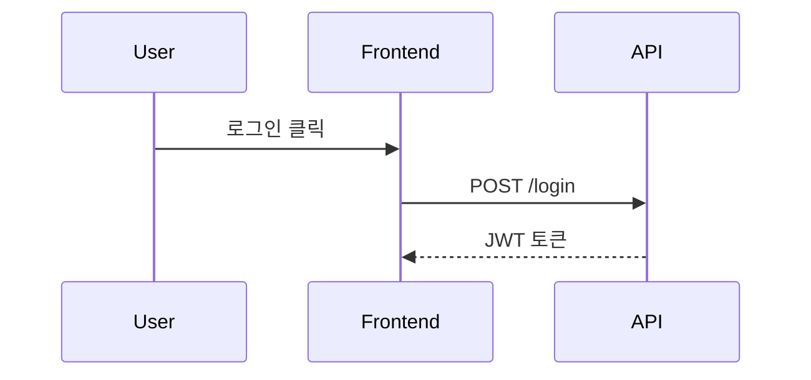

# Cursor에서 BAI AutoTest MCP 사용하기

## 1. 프로젝트 설치

```bash
cd /Users/bettehub/Dev/bai/bai-autotest
pip install -e .
```

`pip install -e .`는 편집 가능 모드로 설치하여 코드 수정이 즉시 반영됩니다.

## 2. Cursor 설정

### 방법 1: 로컬 MCP 설정 (권장)

1. Cursor 설정 열기 (Cmd+Shift+P → "Preferences: Open User Settings (JSON)")
2. 다음 설정 추가:

```json
{
  "mcpServers": {
    "bai-autotest": {
      "command": "/Users/bettehub/.pyenv/versions/3.11.9/bin/python",
      "args": ["-m", "bai_test_mcp.mcp.server"],
      "cwd": "/Users/bettehub/Dev/bai/bai-autotest",
      "env": {
        "PYTHONPATH": "/Users/bettehub/Dev/bai/bai-autotest/src"
      }
    }
  }
}
```

### 방법 2: 글로벌 설치 후 사용
```bash
# 패키지 전역 설치
pip install /Users/bettehub/Dev/bai/bai-autotest

# Cursor settings.json에 추가
{
  "mcpServers": {
    "bai-autotest": {
      "command": "bai-autotest",
      "args": ["serve"]
    }
  }
}
```

## 3. Cursor 재시작

1. Cursor 완전히 종료 (Cmd+Q)
2. Cursor 다시 실행

## 4. MCP 도구 확인

1. 새 채팅 시작
2. `@` 입력
3. `bai-autotest` 선택
4. 사용 가능한 도구 확인:
   - `parse_diagram` - Mermaid 다이어그램 파싱
   - `generate_test` - 테스트 코드 생성
   - `list_scenarios` - 시나리오 목록 조회
   - `analyze_diagram` - 다이어그램 분석

## 5. 사용 예시

### 다이어그램 파싱
```
@bai-autotest parse_diagram으로 이 다이어그램을 파싱해줘:


```

### 테스트 생성
```
@bai-autotest generate_test로 "User Login Flow" 시나리오의 Playwright 테스트를 생성해줘
```

### 시나리오 목록 조회
```
@bai-autotest list_scenarios로 현재 파싱된 시나리오들을 보여줘
```

### 다이어그램 분석
```
@bai-autotest analyze_diagram으로 위 다이어그램을 분석해줘
```

## 6. 문제 해결

### MCP가 나타나지 않는 경우

1. **Python 경로 확인**
   ```bash
   which python
   # 결과를 settings.json의 command에 사용
   ```

2. **MCP 서버 직접 테스트**
   ```bash
   cd /Users/bettehub/Dev/bai/bai-autotest
   /Users/bettehub/.pyenv/versions/3.11.9/bin/python -m bai_test_mcp.mcp.server
   ```

3. **패키지 설치 확인**
   ```bash
   pip list | grep bai-autotest
   ```

4. **Cursor 개발자 도구 확인**
   - Cmd+Option+I
   - Console 탭에서 오류 확인

### 로그 확인
```bash
# Cursor 로그 위치
~/Library/Application Support/Cursor/logs/
```

### Cursor 설정 파일 위치
- macOS: `~/Library/Application Support/Cursor/User/settings.json`

## 7. 고급 사용법

### 파일 경로로 다이어그램 파싱
```
@bai-autotest parse_diagram으로 file_path: "/path/to/diagram.md" 파일을 파싱해줘
```

### 설정과 함께 테스트 생성
```
@bai-autotest generate_test로 다음 설정으로 테스트를 생성해줘:
- scenario_name: "User Login Flow"
- framework: "cypress"
- config: {"base_url": "http://localhost:3000"}
```

### 테스트 파일로 저장
```
@bai-autotest generate_test로 테스트를 생성하고 output_path: "./tests/login.spec.js"에 저장해줘
```