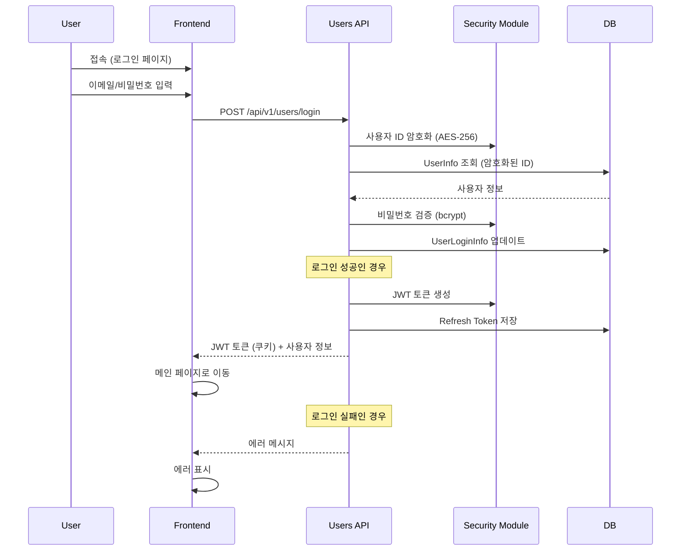

# MCP로 로그인 플로우 테스트 생성 가이드

## 1. Cursor에서 MCP 사용하기

### 다이어그램 파싱

1. 새 채팅을 시작하고 다음과 같이 입력:

```
@bai-autotest parse_diagram으로 이 다이어그램을 파싱해줘:


```

### 파싱 결과 확인

MCP가 다음과 같은 정보를 반환합니다:
- 시나리오 이름
- 참여자(actors) 목록
- 스텝 수
- API 엔드포인트

## 2. 테스트 코드 생성

### Playwright E2E 테스트 (프론트엔드)

```
@bai-autotest generate_test로 파싱된 시나리오의 Playwright 테스트를 생성해줘:
- framework: "playwright"
- config: {"base_url": "http://localhost:3000"}
```

생성되는 테스트 예시:
```javascript
test('User Login Flow', async ({ page }) => {
  // 로그인 페이지 접속
  await page.goto('/login');
  
  // 이메일/비밀번호 입력
  await page.fill('input[type="email"]', 'user@example.com');
  await page.fill('input[type="password"]', 'password123');
  
  // 로그인 버튼 클릭
  await page.click('button:has-text("로그인")');
  
  // 메인 페이지로 이동 확인
  await expect(page).toHaveURL('/dashboard');
});
```

### Pytest API 테스트 (백엔드)

```
@bai-autotest generate_test로 API 테스트를 생성해줘:
- framework: "pytest"
- config: {"base_url": "http://localhost:8000"}
```

생성되는 테스트 예시:
```python
def test_user_login_flow(client, base_url):
    # 로그인 API 호출
    response = client.post(f"{base_url}/api/v1/users/login", json={
        "email": "user@example.com",
        "password": "password123"
    })
    
    assert response.status_code == 200
    assert "access_token" in response.cookies
    assert "user_info" in response.json()
```

### Cypress E2E 테스트 (Next.js)

```
@bai-autotest generate_test로 Cypress 테스트를 생성해줘:
- framework: "cypress"
```

### Jest + RTL 컴포넌트 테스트 (React)

```
@bai-autotest generate_test로 React 컴포넌트 테스트를 생성해줘:
- framework: "jest-rtl"
```

## 3. 테스트 파일로 저장

```
@bai-autotest generate_test로 테스트를 생성하고 파일로 저장해줘:
- scenario_name: "User Login Flow"
- framework: "playwright"
- output_path: "./tests/e2e/login.spec.js"
```

## 4. 다이어그램 분석

```
@bai-autotest analyze_diagram으로 이 다이어그램을 분석해서 
테스트 커버리지와 권장사항을 알려줘
```

분석 결과:
- 보안 관련 스텝 (암호화, bcrypt) 확인
- 성공/실패 케이스 분기 처리
- 필요한 모킹 포인트 제안

## 5. 실제 사용 시나리오

### 시나리오 1: 프론트엔드 E2E 테스트
```
1. 다이어그램 파싱
2. Playwright 테스트 생성
3. 로그인 성공/실패 케이스 분리
4. 쿠키 확인 로직 추가
```

### 시나리오 2: API 통합 테스트
```
1. 다이어그램 파싱
2. Pytest 테스트 생성
3. 모킹: Security 모듈, DB 접근
4. JWT 토큰 검증 로직 추가
```

### 시나리오 3: 풀스택 테스트
```
1. 다이어그램 파싱
2. Playwright (프론트) + Pytest (백엔드) 생성
3. 테스트 간 데이터 연동
```

## 6. 고급 기능

### 커스텀 설정으로 테스트 생성
```
@bai-autotest generate_test로 다음 설정으로 테스트를 생성해줘:
- scenario_name: "User Login Flow"
- framework: "custom"
- language: "java"
- template: "java_spring"
- config: {
    "base_url": "http://localhost:8080",
    "use_mock": true,
    "security_enabled": true
  }
```

### 여러 프레임워크 동시 생성
```
@bai-autotest로 이 시나리오의 테스트를 다음 프레임워크들로 생성해줘:
1. Playwright (E2E)
2. Pytest (API)
3. Jest + RTL (컴포넌트)
```

## 7. 팁과 베스트 프랙티스

1. **다이어그램 작성 시**
   - 명확한 액터 이름 사용
   - API 엔드포인트 명시
   - Note로 조건 분기 표시

2. **테스트 생성 시**
   - base_url 설정 필수
   - 환경별 설정 분리
   - 보안 관련 부분은 모킹 처리

3. **MCP 활용**
   - 시나리오 목록 조회로 확인
   - 분석 도구로 누락된 부분 체크
   - 생성된 코드를 기반으로 커스터마이징