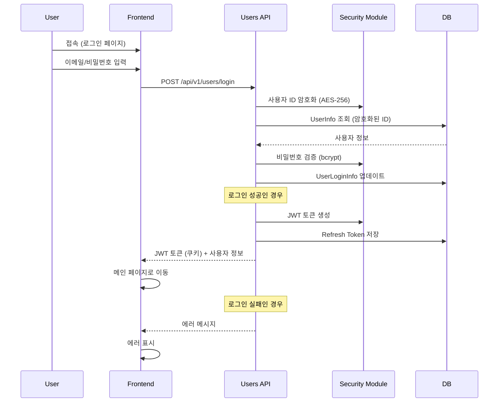
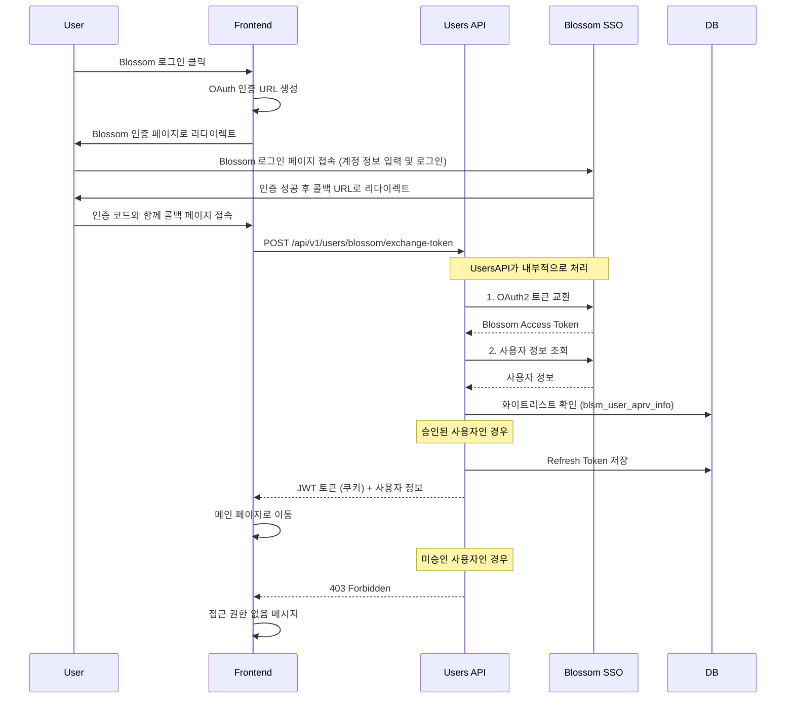

# Authentication Flow Test Scenarios

This document contains Mermaid sequence diagrams for bai.ai.kr authentication flows.

## General Login Flow

```mermaid
sequenceDiagram
    participant User
    participant Frontend
    participant API as Users API
    participant Security as Security Module
    participant DB

    User->>Frontend: 접속 (로그인 페이지)
    User->>Frontend: 이메일/비밀번호 입력
    Frontend->>API: POST /api/v1/users/login
    API->>Security: 사용자 ID 암호화 (AES-256)
    API->>DB: UserInfo 조회 (암호화된 ID)
    DB-->>API: 사용자 정보
    API->>Security: 비밀번호 검증 (bcrypt)
    API->>DB: UserLoginInfo 업데이트
    Note over API: 로그인 성공인 경우
    API->>Security: JWT 토큰 생성
    API->>DB: Refresh Token 저장
    API-->>Frontend: JWT 토큰 (쿠키) + 사용자 정보
    Frontend->>Frontend: 메인 페이지로 이동
    Note over API: 로그인 실패인 경우
    API-->>Frontend: 에러 메시지
    Frontend->>Frontend: 에러 표시
```

## Blossom OAuth2 Login Flow

```mermaid
sequenceDiagram
    participant User
    participant Frontend
    participant UsersAPI as Users API
    participant Blossom as Blossom SSO
    participant DB

    User->>Frontend: Blossom 로그인 클릭
    Frontend->>Frontend: OAuth 인증 URL 생성
    Frontend->>User: Blossom 인증 페이지로 리다이렉트
    User->>Blossom: Blossom 로그인 페이지 접속 (계정 정보 입력 및 로그인)
    Blossom->>User: 인증 성공 후 콜백 URL로 리다이렉트
    User->>Frontend: 인증 코드와 함께 콜백 페이지 접속
    Frontend->>UsersAPI: POST /api/v1/users/blossom/exchange-token
    Note over UsersAPI, Blossom: UsersAPI가 내부적으로 처리
    UsersAPI->>Blossom: 1. OAuth2 토큰 교환
    Blossom-->>UsersAPI: Blossom Access Token
    UsersAPI->>Blossom: 2. 사용자 정보 조회
    Blossom-->>UsersAPI: 사용자 정보
    UsersAPI->>DB: 화이트리스트 확인 (blsm_user_aprv_info)
    Note over UsersAPI: 승인된 사용자인 경우
    UsersAPI->>DB: Refresh Token 저장
    UsersAPI-->>Frontend: JWT 토큰 (쿠키) + 사용자 정보
    Frontend->>Frontend: 메인 페이지로 이동
    Note over UsersAPI: 미승인 사용자인 경우
    UsersAPI-->>Frontend: 403 Forbidden
    Frontend->>Frontend: 접근 권한 없음 메시지
```