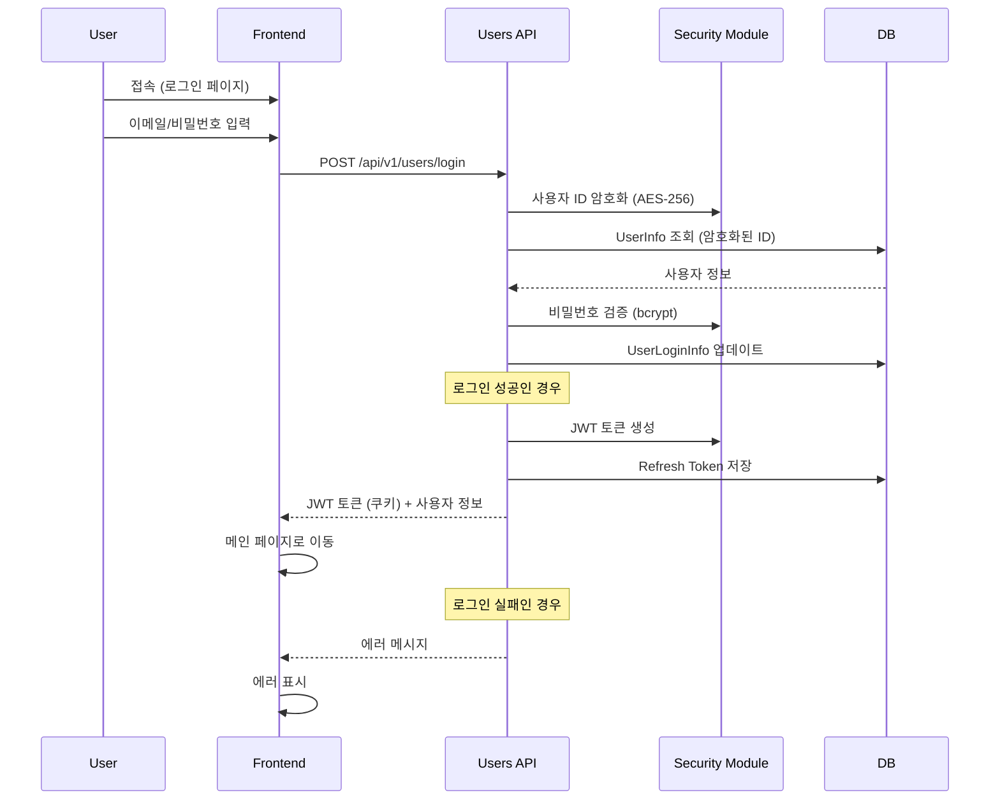

# 로그인 플로우 테스트 예제

## 시퀀스 다이어그램



## MCP 명령어 예시

### 1. 다이어그램 파싱
```
@bai-autotest parse_diagram으로 file_path: "examples/login-flow.md" 파일을 파싱해줘
```

### 2. Playwright E2E 테스트 생성
```
@bai-autotest generate_test로 다음 설정으로 테스트를 생성해줘:
- scenario_name: "User Login Flow"
- framework: "playwright"
- config: {"base_url": "http://localhost:3000"}
- output_path: "./tests/e2e/login.spec.js"
```

### 3. Pytest API 테스트 생성
```
@bai-autotest generate_test로 다음 설정으로 테스트를 생성해줘:
- scenario_name: "User Login Flow"
- framework: "pytest"
- config: {"base_url": "http://localhost:8000", "use_async": true}
- output_path: "./tests/api/test_login.py"
```

### 4. 다이어그램 분석
```
@bai-autotest analyze_diagram으로 이 로그인 플로우를 분석하고 
보안 관련 테스트 포인트를 알려줘
```

## 생성되는 테스트 예시

### Playwright (프론트엔드)
- 로그인 페이지 접속 테스트
- 폼 입력 검증
- 로그인 성공 시 리다이렉션
- 로그인 실패 시 에러 메시지
- 쿠키 설정 확인

### Pytest (백엔드)
- POST /api/v1/users/login 엔드포인트 테스트
- 유효한/무효한 자격증명 테스트
- JWT 토큰 생성 검증
- Refresh Token 저장 확인
- 보안 모듈 통합 테스트

### 추가 테스트 시나리오
- 동시 로그인 방지
- 로그인 시도 횟수 제한
- 토큰 만료 처리
- CSRF 보호